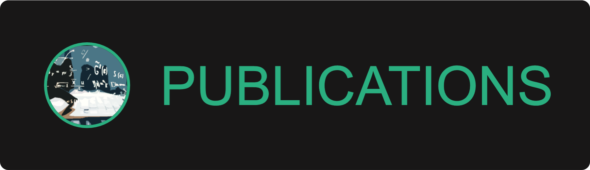

# AS8 Publications
The AS8 Organization has launched a project called AS8 Publications to ensure that programming-related macro resources such as eBooks and magazines are freely available t everyone. On this website, you will find learning resources that have been created by our community and collaborators.

 

## How to contribute
- If you want to publish your eBook, mail us on team.as8.org@gmail.com
- If you have found any bug on this site, create an [issue](https://github.com/The-AS8-organization/Publications/issues) and report the bug.
- If you want to contribute in the site's development, then please fork this repo and create a pull request.

 

## License
Details can be found in [LICENSE](LICENSE)
